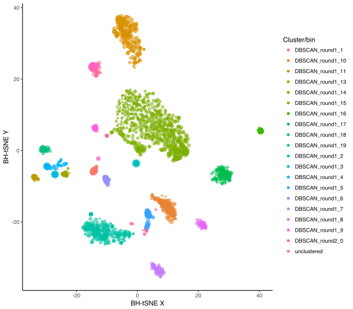
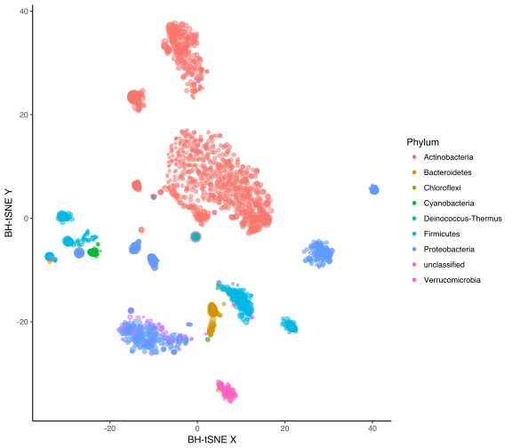
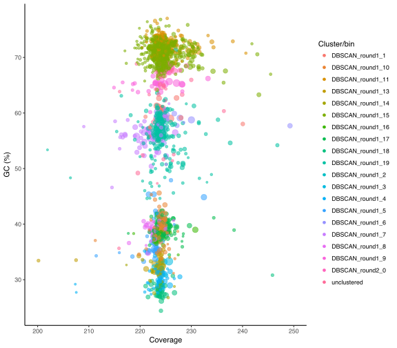

Autometa
=========

An automated binning pipeline for single metagenomes, in particular host-associated and highly complex ones. Autometa is copyright 2018 Ian J. Miller, Evan Rees, Izaak Miller and Jason C. Kwan, and is released under the GNU Affero General Public License v3 (see LICENSE.txt). If you find Autometa useful to your work, please cite:

Miller, I. J.; Rees, E. R.; Ross, J.; Miller, I.; Baxa, J.; Lopera, J.; Kerby, R. L.; Rey, F. E.; Kwan, J. C. Autometa: Automated extraction of microbial genomes from individual shotgun metagenomes. *Nucleic Acids Research*, **2019**. [DOI: https://doi.org/10.1093/nar/gkz148](https://doi.org/10.1093/nar/gkz148)

Dependencies
------------

Note
----

Autometa only runs on Python 3, and is _not_ currently compatible with Python 2. Previous releases used python 2.7, however, these releases may cause installation difficulties as the tsne dependency is no longer available on python 2.7.

If you already have python installed, you can determine your python version with the command: `python --version` or `python -V`

#### Package management tool

* [Anaconda](https://www.anaconda.com) or [Miniconda](https://docs.conda.io/en/latest/miniconda.html) (lightweight version of anaconda)

#### Third party programs

* [Prodigal](https://github.com/hyattpd/prodigal/releases/)
* [HMMER](http://hmmer.org)
* [DIAMOND](https://github.com/bbuchfink/diamond)

#### Databases

Note: these will be automatically downloaded the first time you run `make_taxonomy_table.py`). You will need ~150 GB (at time of writing) to download and process these.

* [nr](ftp://ftp.ncbi.nlm.nih.gov/blast/db/FASTA/nr.gz) (Note: tested with newer NR versions without GI numbers)
* [taxdump.tar.gz](ftp://ftp.ncbi.nlm.nih.gov/pub/taxonomy/taxdump.tar.gz)
* [prot.accession2taxid.gz](ftp://ftp.ncbi.nlm.nih.gov/pub/taxonomy/accession2taxid/prot.accession2taxid.gz)

#### Python packages (Note: this list assumes the use of Anaconda Python)

* [tqdm](https://pypi.python.org/pypi/tqdm/4.19.5)
* [BioPython](http://biopython.org)
* [tsne](https://pypi.python.org/pypi/tsne)
* [joblib](https://pypi.python.org/pypi/joblib)

Additionally, if you want to calculate your own contig coverages (rather than using the k-mer coverage values given by the SPAdes assembler), you will need:

* [Bowtie2](http://bowtie-bio.sourceforge.net/bowtie2/index.shtml)
* [Samtools](https://github.com/samtools/samtools)
* [Bedtools](http://bedtools.readthedocs.io/en/latest/)

Installation
------------

The following was tested on the Autometa [Docker](https://www.docker.com) image, which is based on the [Anaconda Docker image](https://hub.docker.com/r/continuumio/anaconda/). These instructions should work on [Debian](https://www.debian.org)-based linux distros such as [Ubuntu](https://www.ubuntu.com).

#### First install [miniconda](https://docs.conda.io/en/latest/miniconda.html# "miniconda).

```bash
wget https://repo.anaconda.com/miniconda/Miniconda3-latest-Linux-x86_64.sh
bash Miniconda3-latest-Linux-x86_64.sh
```

#### Download Autometa, setup compute environment and format marker databases

```bash
# This will download Autometa into your current directory
git clone https://github.com/KwanLab/Autometa.git
# Navigate to Autometa directory
cd Autometa
# Create autometa environment
conda create -n autometa -c bioconda -c conda-forge python=3.7 --file=requirements.txt
## Activate your autometa environment
conda activate autometa
## Setup lca functions
cd pipeline
python setup_lca_functions.py build_ext --inplace
cd -
## Setup HMM databases
hmmpress -f single-copy_markers/Bacteria_single_copy.hmm 
hmmpress -f single-copy_markers/Archaea_single_copy.hmm
```

#### Adding Autometa commands into your environment variable `$PATH`

You can add the `Autometa/pipeline` directory to your `$PATH` environment
variable for easy access to the autometa pipeline's suite of commands.
After doing this, you will not have to specify the entire path to the autometa scripts.

**Note: You should supply the full path to the pipeline directory when updating your `$PATH`**

```bash
# NOTE: The next line assumes your current working directory is in the Autometa directory
export PATH="$PWD/pipeline":$PATH
```

#### Example if you have installed Autometa into your home directory

```bash
export PATH="$HOME/Autometa/pipeline":$PATH
```

#### Examples running autometa with and without the `pipeline` directory in your `$PATH` variable

```bash
# Without $PATH
cd ~/environments/soil/blue_ridge_parkway
python $HOME/Autometa/pipeline/run_autometa.py --assembly sample_1.fna
# With $PATH
run_autometa.py --assembly sample_1.fna
```

### Running with Docker

As an alternative to doing all the above manually, we have provided an Autometa Docker image. First install [Docker](https://www.docker.com), then run the following commands:

```bash
docker pull jasonkwan/autometa:latest
```

This will download a load of stuff and set up the image for you on your system (~3.5 GB).

You will now be able to run the Docker versions of the following scripts using the same command line arguments shown under "Usage".

Normal script                | Docker version
-----------------------------|---------------------------------
calculate\_read\_coverage.py | calculate\_read\_coverage\_docker.py
make\_taxonomy\_table.py     | make\_taxonomy\_table\_docker.py
run\_autometa.py             | run\_autometa\_docker.py
ML\_recruitment.py           | ML\_recruitment\_docker.py
cluster\_process.py          | cluster\_process\_docker.py

### Building a local docker image

You can build your own Autometa docker image from the Autometa Dockerfile using the `docker build` command.

```bash
# Retrieve Autometa source code
git clone https://github.com/KwanLab/Autometa.git
# Navigate to Autometa directory
docker build . -t jasonkwan/autometa:latest
```

Usage
-----
Before you run Autometa, you need to have assembled your shotgun metagenome. We recommend using MetaSPAdes (part of the [SPAdes](http://cab.spbu.ru/software/spades/) package) after removing Illumina adaptors with [Trimmomatic](http://www.usadellab.org/cms/?page=trimmomatic).

Note that if you use SPAdes or something else that names contigs like this:

```
NODE_1_length_319818_cov_8.03695
```

...then Autometa can use the coverage information in the contig names. If you've used another assembler, then you first have to make a coverage table.

```
calculate_read_coverage.py --assembly ~/autometa/test_data/scaffolds.fasta --processors 16 \
	--forward_reads reads_R1.fastq.gz --reverse_reads reads_R2.fastq.gz
```

The above command will produce a table called coverage.tab, containing the coverages of each contig in the assembly file. In tests, this took 4.4 hours with 16 CPUs and 127 million paired reads.

Here we demonstrate the use of Autometa with the test dataset:

```
autometa/test_data/scaffolds.fasta
```

This dataset is the simulated dataset referred to as "78.125 Mbp" in our paper. For your convenience we have also included a pre-calculated coverage table that you can try out below.

```
autometa/test_data/coverage.tab
```

### Step 1: Split data into kingdom bins [optional]

We found that in host-associated metagenomes, this step vastly improves the binning performance of Autometa (and other pipelines) because less eukaryotic contigs will be binned into bacterial bins. However, if you are confident that you do not have eukaryotic contamination, or a mixture of Archaea and Bacteria, then you can skip this stage because it is rather computationally intensive.

```
make_taxonomy_table.py --assembly ~/autometa/test_data/scaffolds.fasta --processors 16 \
	--length_cutoff 3000
```

If you want to use an external coverage table (see above), you can use the --cov_table flag to specify the path to the output of calculate\_read\_coverage.py in the command above.

The first time you run this script, it will automatically download the database files listed above, and format the nr database for DIAMOND to use. By default, unless you specify a directory with the --db_dir flag, a "databases" subdirectory will be made in the Autometa directory. In our testing, the above command took 9.8 hours to run on 16 CPUs the first time (where databases had to be downloaded and compiled), and 7.8 hours when the databases had already been downloaded. Of course, your mileage will vary depending on connection speed, computational specifications, etc., although the most important determinant of the time required will be the complexity of the input dataset.

Make\_taxonomy\_table.py will do the following:

1. Identify genes in each contig with Prodigal.
2. Search gene protein sequences against nr with DIAMOND.
3. Determine the lowest common ancestor (LCA) of blast hits within 10% of the top bitscore.
4. Determine the taxonomy of each contig by examining the LCA of each component protein (see paper for details)

#### Output files produced by make\_taxonomy\_table.py

File                         | Description
-----------------------------|------------
Bacteria.fasta               | Contigs classified as bacterial  
scaffolds_filtered.fasta     | All contigs above the length cutoff
scaffolds_filtered.fasta.tab | Table describing the GC content, length and coverage of filtered contigs
scaffolds_filtered.orfs.daa  | The output from DIAMOND (binary format)
scaffolds_filtered.orfs.faa  | ORF translations obtained from Prodigal
scaffolds_filtered.orfs.lca  | Table describing the lowest common ancestor (LCA) for each ORF
scaffolds_filtered.orfs.tab  | The output from DIAMOND (tab delimited format)
scaffolds_filtered.txt       | The full output from Prodigal
taxonomy.tab                 | Table with information from scaffolds_filtered.fasta.tab, and also the full assigned taxonomy for each contig
unclassified.fasta           | Contigs unclassified on the Kingdom level

Note that in our test data, there are no non-bacterial contigs. For other datasets, make\_taxonomy\_table.py will produce other fasta files, for example Eukaryota.fasta and Viruses.fasta.

### Step 2: Bin bacterial contigs with BH-tSNE and DBSCAN

Note: This procedure can also be used on archaeal sequences, but will most likely not work well on other kingdoms, because the relevant single-copy gene markers are not included in Autometa.

Here we are running Autometa on the Bacteria.fasta file made in step 1.

```
run_autometa.py --assembly Bacteria.fasta --processors 16 --length_cutoff 3000 \
	--taxonomy_table taxonomy.tab
```

If you want to use an external coverage table, use the --cov_table flag to specify the path to the output of calculate\_read\_coverage.py in the command above.

In the above command, we are supplying Bacteria.fasta to Autometa, and also the taxonomy table (taxonomy.tab) produced in step 1. If we supply a taxonomy table, then this information is used to help with clustering. Otherwise, Autometa clusters solely on 5-mer frequency and coverage. We are using the default output directory of the current working directory (this can be set with the --output_dir flag), and by default the pipeline assumes we are looking at bacterial contigs (use --kingdom archaea otherwise). The script will do the following:

1. Find single-copy marker genes in the input contigs with HMMER
2. Reduce the dimensions of 5-mer frequencies to two through [BH-tSNE](https://lvdmaaten.github.io/tsne/) for each contig
3. Cluster contigs based on BH-tSNE coordinates, coverage and (optionally) taxonomy
4. Accept clusters that are estimated to be over 20% complete and 90% pure based on single-copy marker genes
5. Unclustered contigs leftover will be re-clustered until no more acceptable clusters are yielded

For more details on the above process, please see our paper. If you include a taxonomy table in the run\_autometa.py command, Autometa will attempt to further partition the data based on ascending taxonomic specificity (i.e. in the order phylum, class, order, family, genus, species) when clustering unclustered contigs from a previous attempt. We found that this is mainly useful if you have a highly complex metagenome (lots of species), or you have several related species at similar coverage level.

#### Output files produced by run\_autometa.py

File | Description
-----|------------
Bacteria\_filtered.hmm.tbl | Output from HMMER
Bacteria\_filtered\_marker.tab | Table describing the marker genes found in each contig
k-mer\_matrix | Raw 5-mer frequencies for each contig
recursive\_dbscan\_output.tab | Output table containing the cluster (bin) for each contig


### Step 3: Recruit unclustered contigs to bins through supervised machine learning [optional]

In this step we use supervised machine learning to classify the unclustered contigs to the bins that we have produced (formally, the bins produced in step 2 are the training set). Depending on the size of your dataset, this step can be computationally intensive.

```
ML_recruitment.py --contig_tab recursive_dbscan_output.tab \
	--k_mer_matrix k-mer_matrix --out_table ML_recruitment_output.tab
```

In the above command, we give ML\_recruitment.py the output table from step 2 (recursive\_dbscan\_output.tab), as well as the k-mer\_matrix file produced in step 2, and specify the output file (ML\_recruitment\_output.tab). By default, classifications are only made if 10 out of 10 repeat classifications agree, and only if the classification would not increase the apparent contamination estimated by the presence of single-copy marker genes.

The specified output file is a table with the following columns:

Column | Description
-------|------------
contig | Name of the contig in the input fasta
length | Length of the contig in bp
gc     | GC (%) of contig
cov    | Coverage of the contig
kingdom   | Assigned taxonomic kingdom for the contig
phylum    | Assigned taxonomic phylum for the contig
class     | Assigned taxonomic class for the contig
order     | Assigned taxonomic order for the contig
family    | Assigned taxonomic family for the contig
genus     | Assigned taxonomic genus for the contig
species   | Assigned taxonomic species for the contig
taxid     | Assigned NCBI taxonomy ID number for the contig
single\_copy\_PFAMs      | Comma-delimited list of the PFAM accession numbers of single-copy marker genes found within the contig
num\_single\_copies      | The number of single-copy marker genes found within the contig
bh\_tsne\_x              | The X coordinate after dimension reduction by BH-tSNE
bh\_tsne\_y              | The Y coordinate after dimension reduction by BH-tSNE
cluster                  | The cluster assigned by run\_autometa.py
ML\_expanded\_clustering | The cluster assigned by ML\_recruitment.py (includes previous assignments by run\_autometa.py)

### Running all steps in sequence

For convenience, it is possible to run all three of the above steps through run\_autometa.py, as shown below:

```
run_autometa.py --assembly ~/autometa/test_data/scaffolds.fasta --processors 16 \
	--length_cutoff 3000 --maketaxtable --ML_recruitment
```

In the above command, the '--maketaxtable' flag tells run\_autometa.py to run make\_taxonomy\_table.py, and the '--ML_recruitment' flag tells run\_autometa.py to run ML\_recruitment.py. Note, this runs ML\_recruitment.py with the '--recursive' flag.

Analysis of results
-------------------

At the end of the above process, you will have a master table (either recursive\_dbscan\_output.tab or ML\_recruitment\_output.tab) which describes each contig in your metagenome, including which bin each was assigned to. However, this does not directly tell you much about each bin, so you can further process your data with the following command:

```
cluster_process.py --bin_table ML_recruitment_output.tab --column ML_expanded_clustering \
	--fasta Bacteria.fasta --do_taxonomy --db_dir ~/autometa/databases \
	--output_dir cluster_process_output
```

This will do a number of things:

1. Create a directory called "cluster\_process\_output" in the current working directory
2. Split Bacteria.fasta into separate fastas for each cluster (including unclustered contigs) and write them to the cluster\_process\_output folder
3. Create a file called cluster\_summary\_table, and store it in the cluster\_process\_output folder
4. Create a file called cluster\_taxonomy.tab, and store it in the cluster\_process\_output folder

Note: if you don't want to analyze the taxonomy of your clusters, you can omit the --do\_taxonomy and --db\_dir arguments. To analyze taxonomy here, you also need to have run make\_taxonomy\_table.py above.

Cluster\_summary\_table contains the following columns:

Column          | Description
----------------|------------
cluster         | The name of the cluster
size            | The size of the cluster in bp
longest_contig  | The length in bp of the longest contig in the cluster
n50             | The n50 of the contigs in the cluster
number\_contigs | The number of contigs in the cluster
completeness    | The estimated completeness of the cluster, based on single-copy marker genes
purity          | The estimated purity of the cluster, based on the number of single-copy marker genes that are duplicated in the cluster
av_cov          | The average coverage of contigs in the cluster, weighted by contig length
av_gc           | The average GC (%) of the contigs in the cluster, weighted by contig length

The cluster\_taxonomy.tab file similarly contains full taxonomic information for each cluster, assigned based on the assigned taxonomy of the component contigs.

### Automappa: An interactive interface for exploration and refinement of metagenomes

Automappa is a tool built to interface with Autometa output to help you explore your binning results. 

For details, see the Automappa page here: https://github.com/WiscEvan/Automappa

### Visualizing your results

Cluster\_process.py gives you some information about the clusters, but it's a good idea to manually look at the data to convince yourself that Autometa did a good job. It's worth noting here that no binning pipeline (including Autometa) is guaranteed to give 100% correct results all the time, and before using the results in publications etc. you should use your biological common sense/judgement. With the tables you have produced, this is easy to do using [R](https://www.r-project.org). Try typing the following in to R:

```
library(ggplot2)
data = read.table('ML_recruitment_output.tab', header=TRUE, sep='\t')
ggplot( data, aes( x = bh_tsne_x, y = bh_tsne_y, col = ML_expanded_clustering )) + \
	geom_point( aes( alpha = 0.5, size = sqrt( data$length ) / 100 )) + \
	guides( color = 'legend', size = 'none', alpha = 'none' ) + \
	theme_classic() + xlab('BH-tSNE X') + ylab('BH-tSNE Y') + \
	guides( color = guide_legend( title = 'Cluster/bin' ))
```



In the above chart the points represent contigs. They are plotted on the two dimensions that result from dimension-reduction by BH-tSNE - you can think of the distance between points as being roughly proportional to their differences in 5-mer frequency. The points are also scaled in size according to the contig length, and they are colored by the assigned cluster/bin. You can see that there are some bins which are well-separated from others, but there are other bins that are close together. Cases like these might be worth investigating manually if you think, for instance, that multiple Autometa bins close together could actually be different parts of the same genome. If clusters are close together, there is also the possibility that contigs in the region have been misassigned.

In addition to using nucleotide composition, Autometa uses coverage and can also use taxonomy to distinguish contigs with similar composition. We can also visualize these differences with R.

```
ggplot( data, aes( x = bh_tsne_x, y = bh_tsne_y, col = phylum )) + \
	geom_point( aes( alpha = 0.5, size = sqrt( data$length ) / 100 )) + \
	guides( color = 'legend', size = 'none', alpha = 'none' ) + \
	theme_classic() + xlab('BH-tSNE X') + ylab('BH-tSNE Y') + \
	guides( color = guide_legend( title = 'Phylum' ))
```



In the above plot, we have now colored the points by taxonomic phylum, and this reveals that several clusters that are close together in BH-tSNE space are in fact quite divergent from one another. This is probably the basis for Autometa's assignment of separate bins in these cases. In some cases, the contigs in a bin may in fact look divergent in plots like this (see, for example the grouping in the bottom left of the plot). You may want to manually examine cases such as these, but they could well be real if, for example, some contigs have few protein coding genes, or the organism is highly divergent from known sequences (see our paper [here](https://www.nature.com/articles/srep34362) for some examples). In this particular dataset, the coverages of all genomes are fairly similar, as revealed in the next plot:

```
ggplot( data, aes( x = cov, y = gc, col = ML_expanded_clustering )) + \
	geom_point( aes( alpha = 0.5, size = sqrt( data$length ) / 100 )) + \
	guides( color = 'legend', size = 'none', alpha = 'none' ) + \
	theme_classic() + xlab('Coverage') + ylab('GC (%)') + \
	guides( color = guide_legend( title = 'Cluster/bin' )) + \
	scale_x_continuous( limits = c( 200, 250 ))
```



In the above plot, the points are colored by cluster/bin again, and you can see that in this case, coverage is not much of a distinguishing feature. In other datasets, you may see closely related genomes at different coverages, which will be separatable by Autometa.
