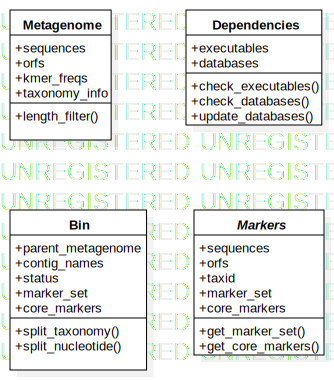

Autometa 2.0
=========

Installation
------------

```bash
conda create -n autometa python=3.7
conda install -n autometa -c bioconda  -y \
    biopython \
    pandas \
    tqdm \
    numpy \
    scikit-learn \
    samtools \
    bowtie2 \
    hmmer \
    prodigal \
    diamond \
    ipython \
    && conda clean -a -y
```

Dependencies
------------

Databases

* [nr](ftp://ftp.ncbi.nlm.nih.gov/blast/db/FASTA/nr.gz) (Note: tested with newer NR versions without GI numbers)
* [taxdump.tar.gz](ftp://ftp.ncbi.nlm.nih.gov/pub/taxonomy/taxdump.tar.gz)
* [prot.accession2taxid.gz](ftp://ftp.ncbi.nlm.nih.gov/pub/taxonomy/accession2taxid/prot.accession2taxid.gz)


