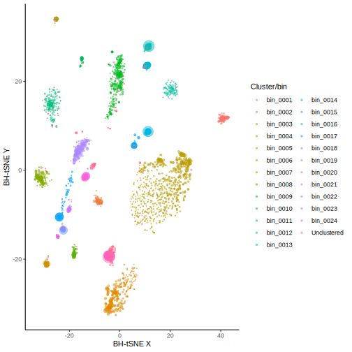
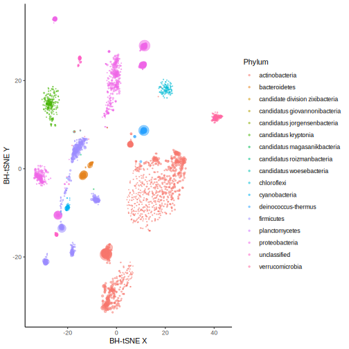
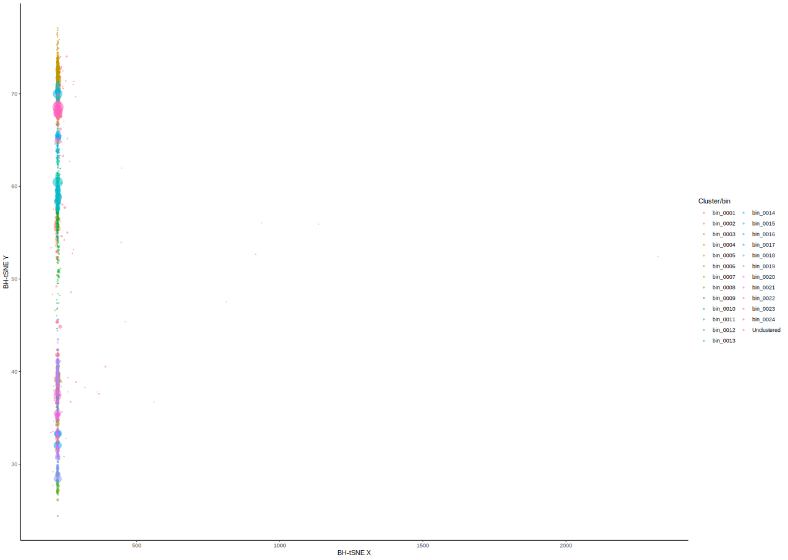

=================
Examining Results
=================

Automappa
=========

An interactive interface for exploration and refinement of metagenomes Automappa is a tool built to interface with Autometa output to help you explore your binning results.

For details, see the `Automappa page <https://github.com/WiscEvan/Automappa>`__

.. note::
    The performance of Automappa may slow down when trying to visualize highly complex communities.

Visualize bins
==============

To run the following commands you'll need to install `R <https://www.r-project.org/>`_, `Rstudio <https://www.rstudio.com/products/rstudio/download/>`_ and `ggplot2 <https://ggplot2.tidyverse.org/>`_ package in R.

You can now run the following R scripts (preferably in RStudio) to examine your results.

.. code-block:: R

    # Load packages
    library("ggplot2")

    # Read the main binning table
    filepath="/Users/sidd/Research/simulated/78mbp_metagenome.main.tsv"
    data = read.table(filepath, header=TRUE, sep='\t')

    # Fill empty cells as unclustered
    data$cluster <- sub("^$", "Unclustered", data$cluster)

    ggplot(data, aes(x=x_1, y=x_2, color=cluster, group=cluster)) +
        geom_point(size=(sqrt(data$length))/100, shape=20, alpha=0.5) +
        theme_classic() + xlab('BH-tSNE X') + ylab('BH-tSNE Y') +
        guides( color = guide_legend( title = 'Genome Bin' ))

In the above chart each point represents a contig. They are plotted on two axes using results from dimension-reduction of k-mer frequencies. Rough differences between K-mer frequencies are utilized to guide Autometa's density-based binning algorithm. Points are also scaled in size according to their respective contig's length and  colored by their assigned genome bin. You can see that there are some bins which are well-separated from others, while other bins are closer together. The latter cases may be worth investigating manually as multiple Autometa bins close together could actually be different parts of the same genome.

In addition to using nucleotide composition, Autometa uses coverage and can also use taxonomy to distinguish contigs with similar composition. We can also visualize these differences with R.

.. code-block:: R

    ggplot(data, aes(x=x_1, y=x_2, color=phylum, group=phylum)) +
        geom_point(size=(sqrt(data$length))/100, shape=20, alpha=0.5) +
        theme_classic() + xlab('BH-tSNE X') + ylab('BH-tSNE Y') +
        guides( color = guide_legend( title = 'Phylum' ))

In the above plot, we have now colored the points by taxonomic phylum, and this reveals that several clusters that are close together in BH-tSNE space are in fact quite divergent from one another (like bottom left). This is probably the basis for Autometa's assignment of separate bins in these cases.

In some cases, the contigs in a bin may in fact look divergent. You may want to manually examine cases such as these, but they could well be real if, for example, some contigs have few protein coding genes, or the organism is highly divergent from known sequences (see our paper `here <https://www.nature.com/articles/srep34362>`__ for some examples).

In this particular dataset, the coverages of all genomes are fairly similar, as revealed in the next plot:

.. code-block:: R

    ggplot(data, aes(x=coverage, y=gc_content, color=cluster, group=cluster)) +
        geom_point(size=(sqrt(data$length))/100, shape=20, alpha=0.5) +
        theme_classic() + xlab('Coverage') + ylab('GC content') +
        guides( color = guide_legend( title = 'Genome Bin' ))

In the above plot, the points are colored by genome bin again, and you can see that in this case, coverage is not much of a distinguishing feature. In other datasets, you may see closely related genomes at different coverages, which will be separable by Autometa.
