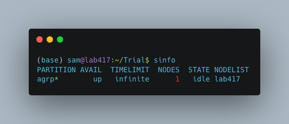
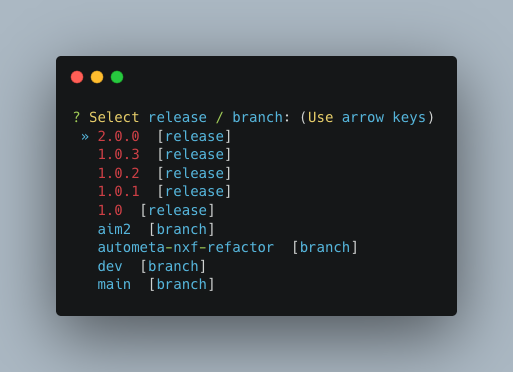
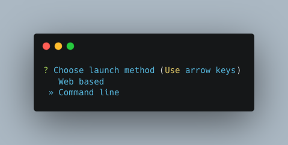
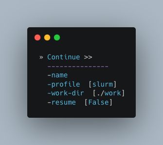
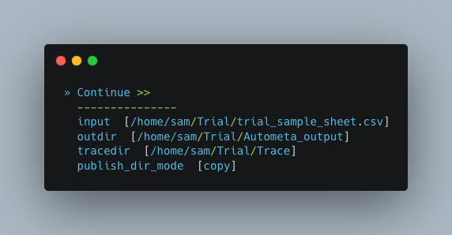
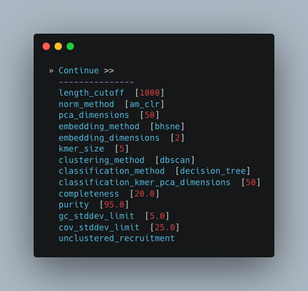
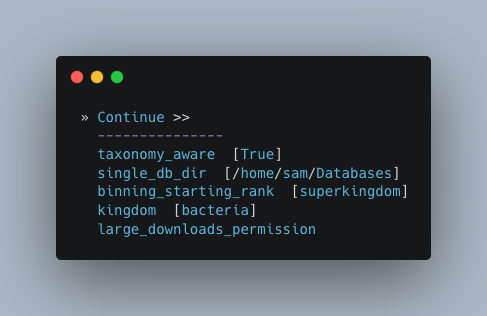
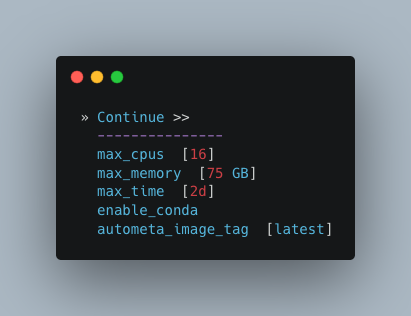
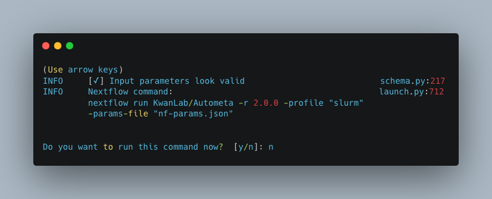
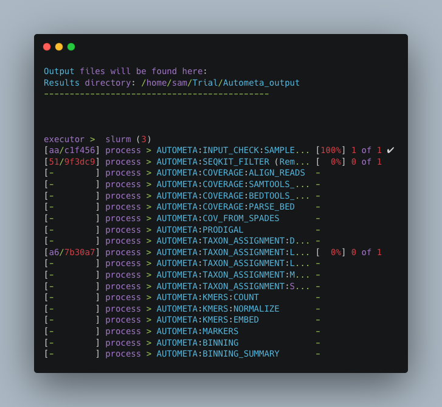

.. _autometa-nextflow-workflow:

=======================
🍏 Nextflow Workflow 🍏
=======================

Why nextflow?
#############

Nextflow helps Autometa produce reproducible results while allowing the pipeline to scale across different platforms and hardware.

System Requirements
###################

Currently the nextflow pipeline requires Docker 🐳 so it must be installed on your system.
If you don't have Docker installed you can install it from `docs.docker.com/get-docker <https://docs.docker.com/get-docker>`_.
We plan on removing this dependency in future versions, so that other dependency managers
(e.g. Conda, Singularity, etc) can be used.

Nextflow runs on any Posix compatible system. Detailed system requirements
can be found in the `nextflow documentation <https://www.nextflow.io/docs/latest/getstarted.html#requirements>`_

Nextflow (required) and nf-core tools (optional but highly recommended) installation will be discussed in :ref:`install-nextflow-nfcore-with-conda`.

Data Preparation
################

#. :ref:`metagenome-assembly`
#. :ref:`sample-sheet-preparation`

.. _metagenome-assembly:

Metagenome Assembly
*******************

You will first need to assemble your shotgun metagenome, to provide to Autometa as input.

The following is a typical workflow for metagenome assembly:

#. Trim adapter sequences from the reads

   * We usually use Trimmomatic_.

#. Quality check the trimmed reads to ensure the adapters have been removed

   * We usually use FastQC_.

#. Assemble the trimmed reads

   * We usually use MetaSPAdes which is a part of the SPAdes_ package.

#. Check the quality of your assembly (Optional)

   * We usually use metaQuast_ for this (use ``--min-contig 1`` option to get an accurate N50).
    This tool can compute a variety of assembly statistics one of which is N50.
    This can often be useful for selecting an appropriate length cutoff value for pre-processing the metagenome.

.. _sample-sheet-preparation:

Preparing a Sample Sheet
************************

An example sample sheet for three possible ways to provide a sample as an input is provided below. The first example
provides a metagenome with paired-end read information, such that contig coverages may be determined using a read-based alignment
sub-workflow. The second example uses pre-calculated coverage information by providing a coverage table *with* the input metagenome assembly.
The third example retrieves coverage information from the assembly contig headers (Currently, this is only available with metagenomes assembled using SPAdes)

.. note::

    If you have paired-end read information, you can supply these file paths within the sample sheet and the coverage
    table will be computed for you (See ``example_1`` in the example sheet below).

    If you have used any other assembler, then you may also provide a coverage table (See ``example_2`` in the example sheet below).
    Fortunately, Autometa can construct this table for you with: ``autometa-coverage``.
    Use ``--help`` to get the complete usage or for a few examples see :ref:`coverage-calculation`.

    If you use SPAdes then Autometa can use the k-mer coverage information in the contig names (``example_3`` in the example sample sheet below).

+-----------+--------------------------------------+----------------------------------------+----------------------------------------+-----------------------+-------------------------+
| sample    | assembly                             | fastq_1                                | fastq_2                                | coverage_tab          | cov_from_assembly       |
+===========+======================================+========================================+========================================+=======================+=========================+
| example_1 | /path/to/example/1/metagenome.fna.gz | /path/to/paired-end/fwd_reads.fastq.gz | /path/to/paired-end/rev_reads.fastq.gz |                       | 0                       |
+-----------+--------------------------------------+----------------------------------------+----------------------------------------+-----------------------+-------------------------+
| example_2 | /path/to/example/2/metagenome.fna.gz |                                        |                                        | /path/to/coverage.tsv | 0                       |
+-----------+--------------------------------------+----------------------------------------+----------------------------------------+-----------------------+-------------------------+
| example_3 | /path/to/example/3/metagenome.fna.gz |                                        |                                        |                       | spades                  |
+-----------+--------------------------------------+----------------------------------------+----------------------------------------+-----------------------+-------------------------+

.. note::

   To retrieve coverage information from a sample's contig headers, provide the ``assembler`` used for the sample value in the row under the ``cov_from_assembly`` column.
   Using a ``0`` will designate to the workflow to try to retrieve coverage information from the coverage table (if it is provided)
   or coverage information will be calculated by read alignments using the provided paired-end reads. If both paired-end reads and a coverage table are provided,
   the pipeline will prioritize the coverage table.

   If you are providing a coverage table to ``coverage_tab`` with your input metagenome, it must be tab-delimited and contain *at least* the header columns, ``contig`` and ``coverage``.

Supported Assemblers for ``cov_from_assembly``
----------------------------------------------

+--------------+-----------------+-----------------------+
|    Assembler | Supported (Y/N) | ``cov_from_assembly`` |
+==============+=================+=======================+
| [meta]SPAdes |        Y        |       ``spades``      |
+--------------+-----------------+-----------------------+
|    Unicycler |        N        |     ``unicycler``     |
+--------------+-----------------+-----------------------+
|      Megahit |        N        |      ``megahit``      |
+--------------+-----------------+-----------------------+

You may copy the below table as a csv and paste it into a file to begin your sample sheet. You will need to update your input parameters, accordingly.

Example ``sample_sheet.csv``
----------------------------

.. code-block:: bash

    sample,assembly,fastq_1,fastq_2,coverage_tab,cov_from_assembly
    example_1,/path/to/example/1/metagenome.fna.gz,/path/to/paired-end/fwd_reads.fastq.gz,/path/to/paired-end/rev_reads.fastq.gz,,0
    example_2,/path/to/example/2/metagenome.fna.gz,,,/path/to/coverage.tsv,0
    example_3,/path/to/example/3/metagenome.fna.gz,,,,spades

.. caution::

    Paths to any of the file inputs **must be absolute file paths**.

    +-------------------------------------------------+------------------------------------------------------+---------------------------------------------------------------------+
    |                    Incorrect                    |                        Correct                       |                             Description                             |
    +=================================================+======================================================+=====================================================================+
    | ``$HOME/Autometa/tests/data/metagenome.fna.gz`` | ``/home/user/Autometa/tests/data/metagenome.fna.gz`` | Replacing any instance of the ``$HOME`` variable with the real path |
    +-------------------------------------------------+------------------------------------------------------+---------------------------------------------------------------------+
    |         ``tests/data/metagenome.fna.gz``        | ``/home/user/Autometa/tests/data/metagenome.fna.gz`` |               Using the entire file path of the input               |
    +-------------------------------------------------+------------------------------------------------------+---------------------------------------------------------------------+

Quick Start
###########

The following is a condensed summary of steps required to get Autometa installed, configured and running. 
There are links throughout to the appropriate documentation sections that can provide more detail if required.

Installation
************

For full installation instructions, please see the :ref:`installation-page` section

If you would like to install Autometa via conda (I'd recommend it, its almost foolproof!), 
you'll need to first install Miniconda on your system. You can do this in a few easy steps:

1. Type in the following and then hit enter. This will download the Miniconda installer to your home directory.

.. code-block:: bash

    wget https://repo.anaconda.com/miniconda/Miniconda3-latest-Linux-x86_64.sh -O $HOME/Miniconda3-latest-Linux-x86_64.sh

.. note::

    ``$HOME`` is synonymous with ``/home/user`` and in my case is ``/home/sam``

2. Now let’s run the installer. Type in the following and hit enter:

.. code-block:: bash

    bash $HOME/Miniconda3-latest-Linux-x86_64.sh

3.	Follow all of the prompts. Keep pressing enter until it asks you to accept. Then type yes and enter. Say yes to everything.

.. note:: 

    If for whatever reason, you accidentally said no to the initialization, do not fear. 
    We can fix this by running the initialization with the following command:

    .. code-block:: bash

        cd $HOME/miniconda3/bin/
        ./conda init
    

4. 	Finally, for the changes to take effect, you'll need to run the following line of code which effectively acts as a "refresh"

.. code-block:: bash
    
    source ~/.bashrc

Now that you have conda up and running, its time to install the Autometa conda environment. Run the following code:

.. code-block:: bash

    conda env create --file=https://raw.githubusercontent.com/KwanLab/Autometa/main/nextflow-env.yml
    
.. attention::

    You will only need to run the installation (code above) once. The installation does NOT need to be performed every time you wish to use Autometa. 
    Once installation is complete, the conda environment (which holds all the tools that Autometa needs) will live on your server/computer 
    much like any other program you install.

Anytime you would like to run Autometa, you'll need to activate the conda environment. To activate the environment you'll need to run the following command:

.. code-block:: bash

    conda activate autometa-nf

Configuring a scheduler
***********************

For full details on how to configure your scheduler, please see the :ref:`Configuring your process executor` section.

If you are using a Slurm scheduler, you will need to create a configuration file. If you do not have a scheduler, skip ahead to :ref:`Running Autometa`

First you will need to know the name of your slurm partition. Run :code:`sinfo` to find this. In the example below, the partition name is "agrp".

Next, generate a new file called ``slurm_nextflow.config`` via nano:

.. code-block:: bash

    nano slurm_nextflow.config

Then copy the following code block into that new file ("agrp" is the slurm partition to use in our case):

.. code-block:: bash

    profiles {
            slurm {
                process.executor       = "slurm"
                process.queue          = "agrp" // <<-- change this to whatever your partition is called
                docker.enabled         = true
                docker.userEmulation   = true
                singularity.enabled    = false
                podman.enabled         = false
                shifter.enabled        = false
                charliecloud.enabled   = false
                executor {
                    queueSize = 8
                }
            }
        }

Keep this file somewhere central to you. For the sake of this example I will be keeping it in a folder called "Useful scripts" in my home directory 
because that is a central point for me where I know I can easily find the file and it won't be moved e.g.
:code:`/home/sam/Useful_scripts/slurm_nextflow.config`

Save your new file with Ctrl+O and then exit nano with Ctrl+O. 

Installation and set up is now complete. 🎉 🥳 

Running Autometa
****************

For a comprehensive list of features and options and how to use them please see :ref:`Running the pipeline`

Autometa can bin one or several metagenomic datasets in one run. Regardless of the number of metagenomes you
want to process, you will need to provide a sample sheet which specifies the name of your sample, the full path to 
where that data is found and how to retrieve the sample's contig coverage information.

If the metagenome was assembled via SPAdes, Autometa can extract coverage and contig length information from the sequence headers. 

If you used a different assembler you will need to provide either raw reads or a table containing contig/scaffold coverage information. 
Full details for data preparation may be found under :ref:`sample-sheet-preparation` 

First ensure that your Autometa conda environment is activated. You can activate your environment by running:

.. code-block:: bash
    
    conda activate autometa-nf

Run the following code to launch Autometa:

.. code-block:: bash

    nf-core launch KwanLab/Autometa

.. note::

    You may want to note where you have saved your input sample sheet prior to running the launch command. 
    It is much easier (and less error prone) to copy/paste the sample sheet file path when specifying the input (We'll get to this later in :ref:`quickstart-menu-4`).

You will now use the arrow keys to move up and down between your options and hit your "Enter" or "Return" key to make your choice.

**KwanLab/Autometa nf-core parameter settings:**

#. :ref:`quickstart-menu-1`
#. :ref:`quickstart-menu-2`
#. :ref:`quickstart-menu-3`
#. :ref:`quickstart-menu-4`
#. :ref:`quickstart-menu-5`
#. :ref:`quickstart-menu-6`
#. :ref:`quickstart-menu-7`
#. :ref:`quickstart-menu-8`

.. _quickstart-menu-1:

Choose a version
----------------

The double, right-handed arrows should already indicate the latest release of Autometa (in our case ``2.0.0``). 
The latest version of the tool will always be at the top of the list with older versions descending below. 
To select the latest version, ensure that the double, right-handed arrows are next to ``2.0.0``, then hit "Enter".

.. _quickstart-menu-2:

Choose nf-core interface
------------------------

Pick the ``Command line`` option.

.. note::

    Unless you've done some fancy server networking (i.e. tunneling and port-forwarding), 
    or are using Autometa locally, ``Command line`` is your *only* option.

.. _quickstart-menu-3:

General nextflow parameters
---------------------------

If you are using a scheduler (Slurm in this example), ``-profile`` is the only option you'll need to change. 
If you are not using a scheduler, you may skip this step.

.. _quickstart-menu-4:

Input and Output
----------------

Now we need to give Autometa the full paths to our input sample sheet, output results folder 
and output logs folder (aka where trace files are stored). 

.. note::

    A new folder, named by its respective sample value, will be created within the output results folder for 
    each metagenome listed in the sample sheet.

.. _quickstart-menu-5:

Binning parameters
------------------

If you're not sure what you're doing I would recommend only changing ``length_cutoff``. 
The default cutoff is 3000bp, which means that any contigs/scaffolds smaller than 3000bp will not be considered for binning. 

.. note::

    This cutoff will depend on how good your assembly is: e.g. if your N50 is 1200bp, I would choose a cutoff of 1000. 
    If your N50 is more along the lines of 5000, I would leave the cutoff at the default 3000. I would strongly recommend
    against choosing a number below 900 here. In the example below, I have chosen a cutoff of 1000bp as my assembly was 
    not particularly great (the N50 is 1100bp).

.. _quickstart-menu-6:

Additional Autometa options
---------------------------

Here you have a choice to make: 

* By enabling taxonomy aware mode, Autometa will attempt to use taxonomic data to make your bins more accurate. 

However, this is a more computationally expensive step and will make the process take longer. 

* By leaving this option as the default ``False`` option, Autometa will bin according to coverage and kmer patterns.

Despite your choice, you will need to provide a path to the necessary databases using the ``single_db_dir`` option.
In the example below, I have enabled the taxonomy aware mode and provided the path to where the databases are stored 
(in my case this is :code:`/home/sam/Databases`). 

For additional details on required databases, see the :ref:`Databases` section.

.. _quickstart-menu-7:

Computational parameters
------------------------

This will depend on the computational resources you have available. You could start with the default values and see 
how the binning goes. If you have particularly complex datasets you may want to bump this up a bit. For your 
average metagenome, you won't need more than 150Gb of memory. I've opted to use 75 Gb as a 
starting point for a few biocrust (somewhat diverse) metagenomes. 

.. note::
    
    These options correspond to the resources provided to *each* process of Autometa, *not* the entire workflow itself.

    Also, for TB worth of assembled data you may want to try the :ref:`autometa-bash-workflow` using the
    `autometa-large-data-mode.sh <https://github.com/KwanLab/Autometa/blob/main/workflows/autometa-large-data-mode.sh>`_ template

.. _quickstart-menu-8:

Do you want to run the nextflow command now?
--------------------------------------------

You will now be presented with a choice. If you are NOT using a scheduler, you can go ahead and type ``y`` to launch the workflow.
If you are using a scheduler, type ``n`` - we have one more step to go. In the example below, I am using the slurm scheduler so I have typed ``n``
to prevent immediately performing the nextflow run command.

If you recall, we created a file called :code:`slurm_nextflow.config` that contains the information Autometa will need to communicate with the Slurm scheduler. 
We need to include that file using the :code:`-c` flag (or configuration flag). Therefore to launch the Autometa workflow, run the following command:

.. note::

    You will need to change the :code:`/home/sam/Useful_scripts/slurm_nextflow.config` file path to what is appropriate for your system.

.. code-block:: bash

    nextflow run KwanLab/Autometa -r 2.0.0 -profile "slurm" -params-file "nf-params.json" -c "/home/sam/Useful_scripts/slurm_nextflow.config"

Once you have hit the "Enter" key to submit the command, nextflow will display the progress of your binning run, such as the one below:

When the run is complete, output will be stored in your designated output folder, in my case ``/home/same/Trial/Autometa_output`` (See :ref:`quickstart-menu-4`).

Basic
#####

While the Autometa Nextflow pipeline can be run using Nextflow directly, we designed
it using nf-core standards and templating to provide an easier user experience through
use of the nf-core "tools" python library. The directions below demonstrate using a minimal
Conda environment to install Nextflow and nf-core tools and then running the Autometa pipeline.

.. _install-nextflow-nfcore-with-conda:

Installing Nextflow and nf-core tools with Conda
************************************************

If you have not previously installed/used Conda, you can get it using the
Miniconda installer appropriate to your system, here: `<https://docs.conda.io/en/latest/miniconda.html>`_

After installing conda, running the following command will create a minimal
Conda environment named "autometa-nf", and install Nextflow and nf-core tools.

.. code-block:: bash

    conda env create --file=https://raw.githubusercontent.com/KwanLab/Autometa/main/nextflow-env.yml

If you receive the message...

.. code-block:: bash

    CondaValueError: prefix already exists:

...it means you have already created the environment. If you want to overwrite/update
the environment then add the :code:`--force` flag to the end of the command.

.. code-block:: bash

    conda env create --file=https://raw.githubusercontent.com/KwanLab/Autometa/main/nextflow-env.yml --force

Once Conda has finished creating the environment be sure to activate it:

.. code-block:: bash

    conda activate autometa-nf

Using nf-core
*************

Download/Launch the Autometa Nextflow pipeline using nf-core tools.
The stable version of Autometa will always be the "main" git branch.
To use an in-development git branch switch "main" in the command with
the name of the desired branch. After the pipeline downloads, nf-core will
start the pipeline launch process.

.. code-block:: bash

    nf-core launch KwanLab/Autometa

.. caution::
    
    nf-core will give a list of revisions to use following the above command.
    Any of the version 1.* revisions are NOT supported.

.. attention::

    If you receive an error about schema parameters you may be able to resolve this
    by first removing the existing project and pulling the desired ``KwanLab/Autometa``
    project using ``nextflow``.

    If a local project exists (you can check with ``nextflow list``), first ``drop`` this project:

    ``nextflow drop KwanLab/Autometa``

    Now pull the desired revision:

    .. code:: bash

        nextflow pull KwanLab/Autometa -r 2.0.0
        # or
        nextflow pull KwanLab/Autometa -r main
        # or
        nextflow pull KwanLab/Autometa -r dev
        # Now run nf-core with selected revision from above
        nf-core launch KwanLab/Autometa -r <2.0.0|main|dev>

    Now after re-running ``nf-core launch ...`` select the revision that you downloaded from above.

You will then be asked to choose "Web based" or "Command line" for selecting/providing options.
While it is possible to use the command line version, it is preferred and easier to use the web-based GUI.
Use the arrow keys to select one or the other and then press return/enter.

Setting parameters with a web-based GUI
***************************************

The GUI will present all available parameters, though some extra
parameters may be hidden (these can be revealed by selecting
"Show hidden params" on the right side of the page).

Required parameters
*******************

The first required parameter is the input sample sheet for the Autometa workflow, specified using :code:`--input`. This is the path to your input sample sheet.
See :ref:`Preparing a Sample Sheet` for additional details.

The other parameter is a nextflow argument, specified with :code:`-profile`. This configures nextflow and the Autometa workflow as outlined in the respective
"profiles" section in the pipeline's ``nextflow.config`` file.

    - :code:`standard` (default): runs all process jobs locally, (currently this requires Docker, i.e. docker is enabled for all processes the default profile).
    - :code:`slurm`: submits all process jobs into the slurm queue. See :ref:`using-slurm` before using
    - :code:`docker`: enables docker for all processes

.. caution::

    Additional profiles exists in the ``nextflow.config`` file, however these have not yet been tested. If you
    are able to successfully configure these profiles, please get in touch or submit a pull request and we will add these configurations
    to the repository.

    - :code:`conda`: Enables running all processes using `conda <https://www.nextflow.io/docs/latest/conda.html>`_
    - :code:`singularity`: Enables running all processes using `singularity <https://www.nextflow.io/docs/latest/singularity.html>`_
    - :code:`podman`: Enables running all processes using `podman <https://www.nextflow.io/docs/latest/podman.html>`_
    - :code:`shifter`: Enables running all processes using `shifter <https://www.nextflow.io/docs/latest/shifter.html>`_
    - :code:`charliecloud`: Enables running all processes using `charliecloud <https://www.nextflow.io/docs/latest/charliecloud.html>`_

.. caution::

    Notice the number of hyphens used between ``--input`` and ``-profile``. ``--input`` is an `Autometa` workflow parameter
    where as ``-profile`` is a `nextflow` argument. This difference in hyphens is true for passing in all arguments to the `Autometa`
    workflow and `nextflow`, respectively.

Running the pipeline
********************

After you are finished double-checking your parameter settings, click "Launch"
at the top right of web based GUI page, or "Launch workflow" at the bottom of
the page. After returning to the terminal you should be provided the option
:code:`Do you want to run this command now?  [y/n]`  enter :code:`y` to begin the pipeline.

This process will lead to nf-core tools creating a file named :code:`nf-params.json`.
This file contains your specified parameters that differed from the pipeline's defaults.
This file can also be manually modified and/or shared to allow reproducible configuration
of settings (e.g. among members within a lab sharing the same server).

Additionally all Autometa specific pipeline parameters can be used as command line arguments
using the :code:`nextflow run ...` command by prepending the parameter name with two hyphens
(e.g. :code:`--outdir /path/to/output/workflow/results`)

.. caution::

    If you are restarting from a previous run, **DO NOT FORGET** to also add the ``-resume`` flag to the nextflow run command.
    **Notice only 1 hyphen is used** with the ``-resume`` nextflow parameter!

.. note::

    You can run the ``KwanLab/Autometa`` project without using nf-core if you already have a correctly
    formatted parameters file. (like the one generated from ``nf-core launch ...``, i.e. ``nf-params.json``)
    
    .. code-block:: bash

        nextflow run KwanLab/Autometa -params-file nf-params.json -profile slurm -resume

Advanced
########

Parallel computing and computer resource allotment
**************************************************

While you might want to provide Autometa all the compute resources available in order to get results
faster, that may or may not actually achieve the fastest run time.

Within the Autometa pipeline, parallelization happens by providing all the assemblies at once
to software that internally handles parallelization.

The Autometa pipeline will try and use all resources available to individual
pipeline modules. Each module/process has been pre-assigned resource allotments via a low/medium/high tag.
This means that even if you don't select for the pipeline to run in parallel some modules (e.g. DIAMOND BLAST)
may still use multiple cores.

* The maximum number of CPUs that any single module can use is defined with the :code:`--max_cpus` option (default: 4).
* You can also set :code:`--max_memory` (default: 16GB)
* :code:`--max_time` (default: 240h). :code:`--max_time` refers to the maximum time *each process* is allowed to run, *not* the execution time for the the entire pipeline.

Databases
*********

Autometa uses the following NCBI databases throughout its pipeline:

- Non-redundant nr database
    - `ftp.ncbi.nlm.nih.gov/blast/db/FASTA/nr.gz <https://ftp.ncbi.nlm.nih.gov/blast/db/FASTA/nr.gz>`_
- prot.accession2taxid.gz
    - `ftp.ncbi.nih.gov/pub/taxonomy/accession2taxid/prot.accession2taxid.gz <https://ftp.ncbi.nih.gov/pub/taxonomy/accession2taxid/prot.accession2taxid.gz>`_
- nodes.dmp, names.dmp and merged.dmp - Found within
    - `ftp.ncbi.nlm.nih.gov/pub/taxonomy/taxdump.tar.gz <ftp.ncbi.nlm.nih.gov/pub/taxonomy/taxdump.tar.gz>`_

If you are running autometa for the first time you'll have to download these databases.
You may use ``autometa-update-databases --update-ncbi``. This will download the databases to the default path. You can check
the default paths using ``autometa-config --print``. If you need to change the default download directory you can use
``autometa-config --section databases --option ncbi --value <path/to/new/ncbi_database_directory>``.
See ``autometa-update-databases -h`` and ``autometa-config -h`` for full list of options.

In your ``nf-params.json`` file you also need to specify the directory where the different databases are present.
Make sure that the directory path contains the following databases:

- Diamond formatted nr file => nr.dmnd
- Extracted files from tarball taxdump.tar.gz
- prot.accession2taxid.gz

.. code-block::

    {
        "single_db_dir" = "$HOME/Autometa/autometa/databases/ncbi"
    }

.. note::

    Find the above section of code in ``nf-params.json`` and update this path to the folder
    with all of the downloaded/formatted NCBI databases.

CPUs, Memory, Disk
******************

.. note::

    Like nf-core pipelines, we have set some automatic defaults for Autometa's processes. These are dynamic and each
    process will try a second attempt using more resources if the first fails due to resources. Resources are always
    capped by the parameters (show with defaults):

    - :code:`--max_cpus = 2`
    - :code:`--max_memory = 6.GB`
    - :code:`--max_time = 48.h`

The best practice to change the resources is to create a new config file and point to it at runtime by adding the
flag :code:`-c path/to/custom/file.config`

For example, to give all resource-intensive (i.e. having ``label process_high``) jobs additional memory and cpus, create a file called :code:`process_high_mem.config` and insert

.. code-block:: groovy

    process {
        withLabel:process_high {
            memory = 200.GB
            cpus = 32
        }
    }

Then your command to run the pipeline (assuming you've already run :code:`nf-core launch KwanLab/Autometa` which created
a :code:`nf-params.json` file) would look something like:

.. code-block:: bash

    nextflow run KwanLab/Autometa -params-file nf-params.json -c process_high_mem.config

.. caution::

    If you are restarting from a previous run, **DO NOT FORGET** to also add the ``-resume`` flag to the nextflow run command.

    **Notice only 1 hyphen is used** with the ``-resume`` nextflow parameter!

For additional information and examples see `Tuning workflow resources <https://nf-co.re/usage/configuration#running-nextflow-on-your-system>`_

Additional Autometa parameters
******************************

Up to date descriptions and default values of Autometa's nextflow parameters can be viewed using the following command:

.. code-block:: bash

    nextflow run KwanLab/Autometa -r main --help

You can also adjust other pipeline parameters that ultimately control how binning is performed.

``params.length_cutoff`` : Smallest contig you want binned (default is 3000bp)

``params.kmer_size`` : kmer size to use

``params.norm_method`` : Which kmer frequency normalization method to use. See
:ref:`advanced-usage-kmers` section for details

``params.pca_dimensions`` : Number of dimensions of which to reduce the initial k-mer frequencies
matrix (default is ``50``). See :ref:`advanced-usage-kmers` section for details

``params.embedding_method`` :  Choices are ``sksne``, ``bhsne``, ``umap``, ``densmap``, ``trimap``
(default is ``bhsne``) See :ref:`advanced-usage-kmers` section for details

``params.embedding_dimensions`` : Final dimensions of the kmer frequencies matrix (default is ``2``).
See :ref:`advanced-usage-kmers` section for details

``params.kingdom`` : Bin contigs belonging to this kingdom. Choices are ``bacteria`` and ``archaea``
(default is ``bacteria``).

``params.clustering_method`` : Cluster contigs using which clustering method. Choices are "dbscan" and "hdbscan"
(default is "dbscan"). See :ref:`advanced-usage-binning` section for details

``params.binning_starting_rank`` : Which taxonomic rank to start the binning from. Choices are ``superkingdom``, ``phylum``,
``class``, ``order``, ``family``, ``genus``, ``species`` (default is ``superkingdom``). See :ref:`advanced-usage-binning` section for details

``params.classification_method`` : Which clustering method to use for unclustered recruitment step.
Choices are ``decision_tree`` and ``random_forest`` (default is ``decision_tree``). See :ref:`advanced-usage-unclustered-recruitment` section for details

``params.completeness`` :  Minimum completeness needed to keep a cluster (default is at least 20% complete, e.g. ``20``).
See :ref:`advanced-usage-binning` section for details

``params.purity`` : Minimum purity needed to keep a cluster (default is at least 95% pure, e.g. ``95``).
See :ref:`advanced-usage-binning` section for details

``params.cov_stddev_limit`` : Which clusters to keep depending on the coverage std.dev (default is 25%, e.g. ``25``).
See :ref:`advanced-usage-binning` section for details

``params.gc_stddev_limit`` : Which clusters to keep depending on the GC% std.dev (default is 5%, e.g. ``5``).
See :ref:`advanced-usage-binning` section for details

Customizing Autometa's Scripts
******************************

In case you want to tweak some of the scripts, run on your own scheduling system or modify the pipeline you can clone
the repository and then run nextflow directly from the scripts as below:

.. code-block:: bash

    # Clone the autometa repository into current directory
    git clone git@github.com:KwanLab/Autometa.git

    # Modify some code
    # e.g. one of the local modules
    code $HOME/Autometa/modules/local/align_reads.nf

    # Generate nf-params.json file using nf-core
    nf-core launch $HOME/Autometa

    # Then run nextflow
    nextflow run $HOME/Autometa -params-file nf-params.json -profile slurm

.. note::

    If you only have a few metagenomes to process and you would like to customize Autometa's behavior, it may be easier
    to first try customization of the :ref:`autometa-bash-workflow`

Useful options
**************

``-c`` : In case you have configured nextflow with your executor (see :ref:`Configuring your process executor`)
and have made other modifications on how to run nextflow using your ``nexflow.config`` file, you can specify that file
using the ``-c`` flag

To see all of the command line options available you can refer to
`nexflow CLI documentation <https://www.nextflow.io/docs/latest/cli.html#command-line-interface-cli>`_

Resuming the workflow
*********************

One of the most powerful features of nextflow is resuming the workflow from the last completed process. If your pipeline
was interrupted for some reason you can resume it from the last completed process using the resume flag (``-resume``).
Eg, ``nextflow run KwanLab/Autometa -params-file nf-params.json -c my_other_parameters.config -resume``

Execution Report
****************

After running nextflow you can see the execution statistics of your autometa run, including the time taken, CPUs used,
RAM used, etc separately for each process. Nextflow will generate summary, timeline and trace reports automatically for
you in the ``${params.outdir}/trace`` directory. You can read more about this in the
`nextflow docs on execution reports <https://www.nextflow.io/docs/latest/tracing.html#execution-report>`_.

Visualizing the Workflow
------------------------

You can visualize the entire workflow ie. create the directed acyclic graph (DAG) of processes from the written DOT file. First install
`Graphviz <https://graphviz.org/>`_ (``conda install -c anaconda graphviz``) then do ``dot -Tpng < pipeline_info/autometa-dot > autometa-dag.png`` to get the
in the ``png`` format.

Configuring your process executor
**********************************

For nextflow to run the Autometa pipeline through a job scheduler you will need to update the respective ``profile``
section in nextflow's config file. Each ``profile`` may be configured with any available scheduler as noted in the
`nextflow executors docs <https://www.nextflow.io/docs/latest/executor.html>`_. By default nextflow will use your
local computer as the 'executor'. The next section briefly walks through nextflow executor configuration to run
with the slurm job scheduler.

We have prepared a template for ``nextflow.config`` which you can access from the KwanLab/Autometa GitHub repository using this
`nextflow.config template <https://raw.githubusercontent.com/KwanLab/Autometa/main/nextflow.config>`_. Go ahead
and copy this file to your desired location and open it in your favorite text editor (eg. Vim, nano, VSCode, etc).

.. _using-slurm:

SLURM
-----

This allows you to run the pipeline using the SLURM resource manager. To do this you'll first needed to identify the
slurm partition to use. You can find the available slurm partitions by running ``sinfo``. Example: On running ``sinfo``
on our cluster we get the following:

.. image:: ../img/slurm_partitions.png
    :alt: Screen shot of ``sinfo`` output showing ``queue`` listed under partition

The slurm partition available on our cluster is ``queue``.  You'll need to update this in ``nextflow.config``.

.. code-block:: groovy

    profiles {
        // Find this section of code in nextflow.config
        slurm {
            process.executor       = "slurm"
            // NOTE: You can determine your slurm partition (e.g. process.queue) with the `sinfo` command
            // Set SLURM partition with queue directive.
            process.queue = "queue" // <<-- change this to whatever your partition is called
            // queue is the slurm partition to use in our case
            docker.enabled         = true
            docker.userEmulation   = true
            singularity.enabled    = false
            podman.enabled         = false
            shifter.enabled        = false
            charliecloud.enabled   = false
            executor {
                queueSize = 8
            }
        }
    }

More parameters that are available for the slurm executor are listed in the nextflow
`executor docs for slurm <https://www.nextflow.io/docs/latest/executor.html#slurm>`_.

Docker image selection
**********************

Especially when developing new features it may be necessary to run the pipeline with a custom docker image.
Create a new image by navigating to the top Autometa directory and running ``make image``. This will create a new
Autometa Docker image, tagged with the name of the current Git branch.

To use this tagged version (or any other Autometa image tag) add the argument ``--autometa_image tag_name`` to the nextflow run command

.. _nextflow: https://www.nextflow.io/
.. _Docker: https://www.docker.com/
.. _SPAdes: http://cab.spbu.ru/software/spades/
.. _Trimmomatic: http://www.usadellab.org/cms/?page=trimmomatic
.. _FastQC: https://www.bioinformatics.babraham.ac.uk/projects/fastqc/
.. _metaQuast: http://quast.sourceforge.net/metaquast
