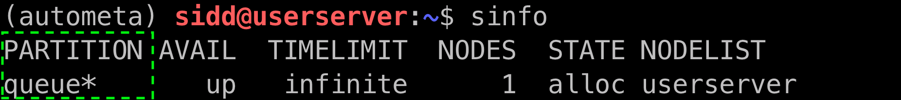

================
Running Autometa
================

Data preparation
================

Before you run Autometa, you need to have assembled your shotgun metagenome. The following workflow is recommended:

#. Trim adapter sequences from the reads. We prefer to use Trimmomatic_, but you can go ahead and any tool of your preference.
#. Quality check of reads to make sure that the adapters have been removed, we use FastQC_ for this.
#. Assemble the trimmed reads. We recommend using MetaSPAdes which is a part of the SPAdes_ package to assemble the trimmed reads but you can use any other assembler as well.
#. An optional thing to do here would be to check the quality of your assembly as well. This would give you N50 which could be useful in selecting the value of length-filter. We tend to use metaQuast_ for this (use ``--min-contig 1`` option to get an accurate N50).

.. note::

    If you use end up using SPAdes then Autometa can use the coverage information in the contig names. If you have used any other assembler, then you first have to make a coverage table.

    Fortunately, Autometa can construct this table for you with: ``python -m autometa.commmon.coverage``. Use ``--help`` to get the complete usage.

Nextflow walkthrough
====================

Why nextflow
------------

.. todo::
    Mention some advantages of using nextflow

Set autometa parameteres
------------------------

Before we start running the pipeline we first need to alter some of the default paprameters in ``parameters.config``. A pre-made template is available on our `Autometa GitHub repository <https://github.com/KwanLab/Autometa>`_ which you can edit and customize as per your needs. You can access the ``parameters.config`` file template from `here <https://github.com/WiscEvan/Autometa/blob/4b4e3c60e076706e28deae4ae4d45f26b5df7dee/nextflow/parameters.config>`_. Go ahead and copy the file to the location of your choice and open it in your favorite text editor (vim, nano, vscode, etc).

.. todo::
    Need to alter the url for ``parameters.config`` after the merge is done.

Data Inputs
^^^^^^^^^^^

.. note::
    Data inputs must be wrapped in 'single quotes' or "double quotes"

The first and the most important thing that you need to alter is the paths to various input and output files.

*params.metagenome* : Change this to point to your metagenome assembly. Eg. ``"/media/bigdrive1/sidd/test_data/78mbp_metagenome.fna"``

*params.interim* : Change this to point to where you want the interim results to be stored. Eg. ``"/media/bigdrive1/sidd//test_data/interim/"``. Nextflow_ will create a new directory if absent.

*params.processed* : Change this to point to where you want the final results to be stored. Eg. ``"/media/bigdrive1/sidd/test_data/processed/"``. Nextflow_ will create a new directory if absent.

.. code-block:: bash

    // Find this section of code in parameters.config
    params.metagenome = "<path/to/assembly.fna>" 
    params.interim = "<path/to/interim_results/>" 
    params.processed = "<path/to/processed_results/>"

You can also input multiple asseblies at once with the help of wildcards. In the below example all the files with extension "fasta" would be taken as input by nextflow_.

.. code-block:: bash

    // Find this section of code in parameters.config
    params.metagenome = "<path/to/assembly_dir/*.fasta>" 
    params.interim = "<path/to/interim_results/>" 
    params.processed = "<path/to/processed_results/>"

.. note::
    Wildcard characters will only be interpreted when "double quotes" are used

Database directory
^^^^^^^^^^^^^^^^^^

Autometa uses the following NCBI databses throughout its pipeline:

- Non-redundant `nr database <ftp://ftp.ncbi.nlm.nih.gov/blast/db/FASTA/nr.gz>`_
- `prot.accession2taxid.gz <ftp://ftp.ncbi.nlm.nih.gov/pub/taxonomy/taxdump.tar.gz>`_
- *nodes.dmp*, *names.dmp* and *merged.dmp* from `taxdump tarball <ftp://ftp.ncbi.nlm.nih.gov/pub/taxonomy/taxdump.tar.gz>`_ 

If you are running autometa for the first time you'll have to download these databases. Use ``autometa-update-databases --update-ncbi``. This will download the databases to the default path. You can check the default paths using ``autometa-config --print``. If you need to change the default download directory you can use ``autometa-config --section databases --option ncbi --value <path/to/new/ncbi_database_directory>``. See ``autometa-update-databases -h`` and ``autometa-config-h`` for full list of options.

In your ``parameters.config`` file you also need to specify the directory where the different databases are present. Make sure that the directory path contains the following databases:

- Diamond formatted nr file => nr.dmnd
- Extracted files from tarball taxdump.tar.gz
- prot.accession2taxid.gz

.. code-block:: bash

    // Find this section of code in parameters.config
    // Update this path to folder with all NCBI databases
    params.ncbi_database = "/Autometa/autometa/databases/ncbi"

Runtime parameteres
^^^^^^^^^^^^^^^^^^^

You can configure the number of CPUs that each job should use.

.. code-block:: bash

    // Find this section of code in parameters.config
    // Change the number of CPUs you want each job to use
    params.cpus = 2

Additional autometa parameteres
^^^^^^^^^^^^^^^^^^^^^^^^^^^^^^^

You can also adjust other pipeline parameteres that ultimate control how the binning would be done.

*params.length_cutoff* : Smallest contiog you want binned (default is 3000bp)

*params.kmer_size* : kmer size to use

*params.kmer_norm_method* : Which normaization method to use. Choices are centered log-ratio transformation (clr), Autometa's clr implementation (am_clr) and isometric log-ratio transformation (default is am_clr)

*params.kmer_pca_dimensions* : Number of dimensions to reduce the initial 512 dimension big k-mer matrix to (default is 50)

*params.kmer_embed_method* :  kmer-embedding method. Choices are "sksne", "bhsne", "umap" (default is bhsne)

*params.kmer_embed_dimensions* : Final dimensions you want to reduce the pca reduced kmer matrix to (default is 2).

*params.kingdom* : Bins contigs belonging to which kingdom. Choices are "bacteria" and "archaea" (default is bacteria)

*params.clustering_method* : Cluster contigs using which clustering method. Choices are "dbscan" and "hdbscan" (default is "dbscan")

*params.binning_starting_rank* : Which taxonomic rank to start the binning from. Choices are "superkingdom", "phylum", "class", "order", "family", "genus", "species" (default is "superkingdom")

*params.classification_method* : Which clustering method to use for unclustered recruitment step. Choices are "decision_tree" and "random_forest" (default is "decision_tree")

*params.completeness* :  Minimum completeness needed to keep a cluster (default is atleast 20% complete)

*params.purity* : Minimum purity needed to keep a cluster (default is atleast 95% pure)

*params.cov_stddev_limit* : Which clusters to keep depending on the covergae std.dev (default is 25%)

*params.gc_stddev_limit* : Which clusters to keep depending on the GC% std.dev (default is 5%)

Running the pipeline
--------------------

You can run autometa using nextflow_ in multiple ways. You can install nexflow using conda by doing ``conda install -c conda-forge nextflow`` or you can also install from source using the instructions mentioned in their `documentation <https://www.nextflow.io/docs/latest/getstarted.html#installation>`_

.. note::
    1. Run the following commands directly in ``bash``. Nexflow will automatically submit jobs to SLURM or any other sheduling system.
    2. You can use `tmux <https://github.com/tmux/tmux/wiki>`_ or `screen <https://www.gnu.org/software/screen/>`_ in case you want to exit the window or disconnect from the server.
    3. The pipeline must be launched from a node where the ``condor_submit`` command is available, that is, in a common usage scenario, the cluster head node.
    4. The HTCondor executor for Nextflow_ does not support at this time the HTCondor ability to transfer input/output data to the corresponding job computing node. Therefore the data needs to be made accessible to the computing nodes using a shared file system directory from where the Nextflow_ workflow has to be executed (or specified via the -w option).

With docker (Simplest)
^^^^^^^^^^^^^^^^^^^^^^

Make sure that you have Docker_ and nextflow_ installed. You can run autometa pipeline using ``nextflow run KwanLab/Autometa -c parameters.config``

In case you want to tweak some of the scripts and modify the pipeline you can clone the repository and then run autometa using ``main.nf``. This is completely optional and would be useful only for development purposes.

.. code-block:: bash

    # Clone the autometa repository
    git clone git@github.com:KwanLab/Autometa.git
    # Navigate to the clone repository
    cd $HOME
    # Run nextflow
    nextflow run main.nf

Without docker
^^^^^^^^^^^^^^

By default autometa's implementation using nextflow_ makes use of Docker_. You can diasble it in either your ``nextflow.config`` file or the ``parameters.config`` file.

Editing ``nextflow.config``:

.. code-block:: bash

    // Find this section of code in nextflow.config
    docker {
    enabled = false // <-- change to this
    // Nextflow will run using the local autometa installation
    // rather than the docker image specified.
    fixOwnership = true
    }

Editing ``parameteres.config``:

.. code-block:: bash

    // Find this section of code in parameteres.config
    docker.enabled = false // override use of docker to use local Autometa installation

Now install autometa using one of the three install methods specified in :ref:`Install` (Directly using conda or from source). After the install you can run autometa using ``nextflow run KwanLab/Autometa -c parameters.config``. Nextflow_ would use the entrypoints created during the install to run autometa. Make sure to actiavte your conda environment before running incase you have installed using conda.

Other useful options
^^^^^^^^^^^^^^^^^^^^

``-c`` : In case you have configured nextflow_ with your executor (see below) and have made other modifications on how to run nextflow_ using your ``nexflow.config`` file, you can specify that file using the ``-c`` flag

``-w`` : BY default nextflow_ uses the current directory to store all the temporary files (called as ``work`` directory). You can change that using the ``-w`` flag

``-p`` : You can specify the executor to use using ``-p`` flag. Rightnow the available profiles are cluster, HTCondor and startard (default).

To see all of the command line options available you can refer to `nexflow CLI documentation <https://www.nextflow.io/docs/latest/cli.html#command-line-interface-cli>`_

Resuming the workflow
^^^^^^^^^^^^^^^^^^^^^

One of the most powerful features of nextflow_ is resuming the workflow from the last checkpoint. If your pipeline was interrupted for some reason you can resume it from the lat checkpoint using the resume flag (``-resume``). Eg, ``nextflow run KwanLab/Autometa -c parameters.config -resume``

Execution Report
^^^^^^^^^^^^^^^^

After running nextflow you can see the execution statistics of your autometa run, including the time taken, CPUs used, RAM used, etc separately for each process. Nextflow would generate a summary report, a timeline report and a trace report automatically for you in the ``pipeline`` directory. You can read more about these execution reports `here <https://www.nextflow.io/docs/latest/tracing.html#execution-report>`_. 

Workflow Visualized
^^^^^^^^^^^^^^^^^^^

You can also visualize the entire workflow ie. create the DAG from the written DOT file. Install `Graphviz <https://graphviz.org/>`_ and do ``dot -Tpng < pipeline_info/autometa-dot > autometa-dag.png`` to get the in the ``png`` format.

Configure nextflow with your 'executor'
---------------------------------------

For nextflow_ to run the Autometa pipeline through a job scheduler you will need to update the respective 'profile' section in nextflow's config file. Each 'profile' may be configured with any available scheduler as noted in the `nextflow executors docs <https://www.nextflow.io/docs/latest/executor.html>`_. By default nextflow_ will use your local computer as the 'executor'. The next section briefly walks through nextflow_ executor configuration to run with the slurm job scheduler.

We have prepared a template for ``nextflow.config`` which you can access from our GitHub repository using this `link <https://github.com/WiscEvan/Autometa/blob/4b4e3c60e076706e28deae4ae4d45f26b5df7dee/nextflow.config>`_. Go ahead and copy this file to your desired location and open it in your favorite text editor (eg. Vim, nano, VSCode, etc).

SLURM
^^^^^

This allows you to run the pipeline using the SLURM resource manager. To do this you'll first needed to identify the slurm partition to use. You can find the available slurm partitions by running ``sinfo``. Example: On running ``sinfo`` on our cluster we get the following:

The slurm partition available on our cluster is queue.  You'll need to update this in ``nextflow.config``. 

.. todo::
    Change the path to ``nextflow.config`` after the merge.

.. code-block:: bash

    // Find this section of code in nextflow.config
    }
    cluster {
    process.executor = "slurm"
    // queue is the slurm partition to use in our case
    // Set SLURM partition with queue directive.
    process.queue = "queue" // <<-- change this to whatever your partition is called
    // See https://www.nextflow.io/docs/latest/executor.html#slurm for more details.
    }

More parameters that are available for the slurm executor are listed in the nextflow `executor docs for slurm <https://www.nextflow.io/docs/latest/executor.html#slurm>`_.

HTCondor
^^^^^^^^

This allows you to run the pipeline using the HTCondor resource manager. To do this you'll need to enable the HTCondor executor to condor value in the ``nextflow.config``.

.. code-block:: bash

    // Find this section of code in nextflow.config
    }
    chtc {
        process.executor = "condor"
        // See https://www.nextflow.io/docs/latest/executor.html#htcondor for more configuration options.
    }

More parameters that are available for the slurm executor are listed in the nextflow executor `docs for HTCondor <https://www.nextflow.io/docs/latest/executor.html#htcondor>`_.

.. _nextflow: https://www.nextflow.io/
.. _Docker: https://www.docker.com/
.. _SPAdes: http://cab.spbu.ru/software/spades/
.. _Trimmomatic: http://www.usadellab.org/cms/?page=trimmomatic
.. _FastQC: https://www.bioinformatics.babraham.ac.uk/projects/fastqc/
.. _metaQuast: http://quast.sourceforge.net/metaquast
